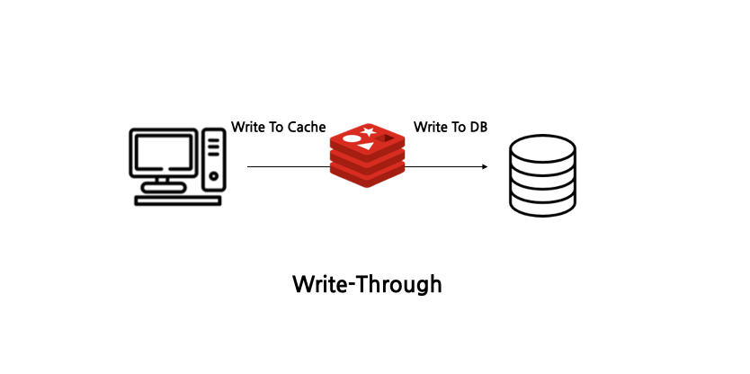
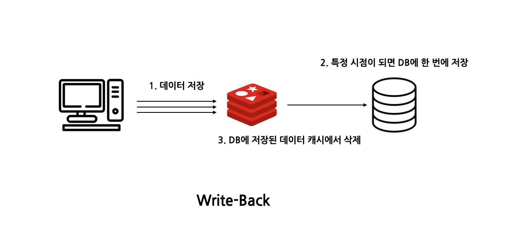
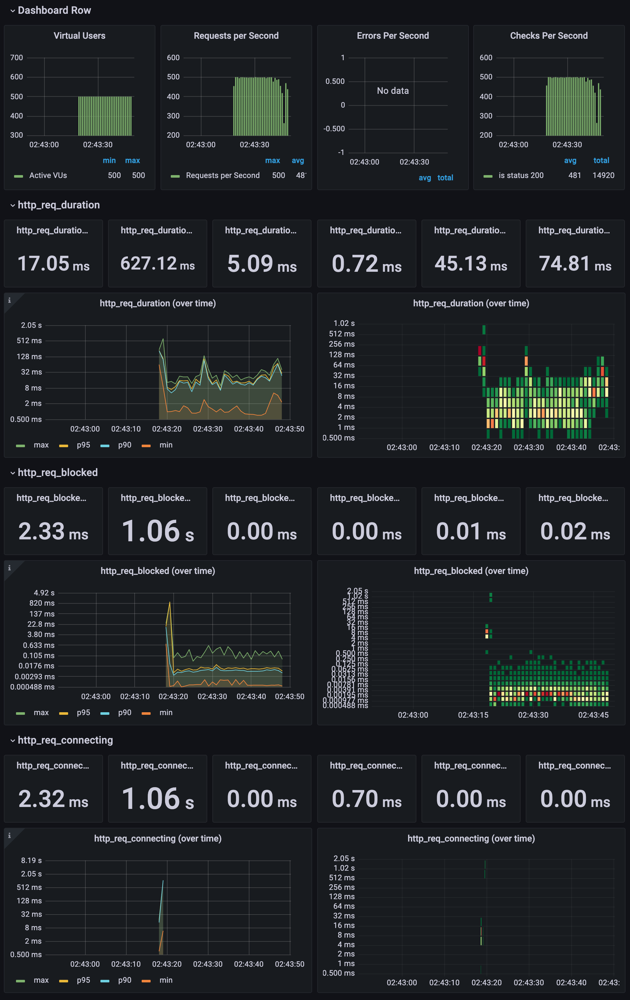
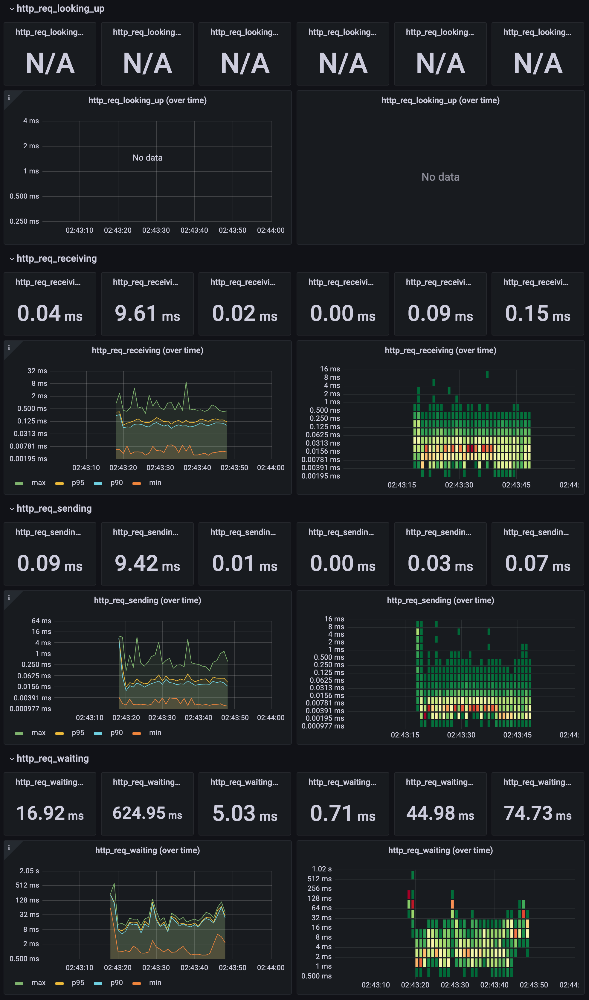
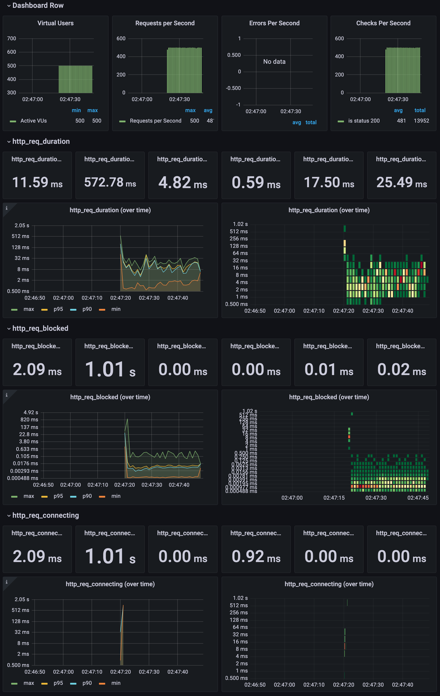
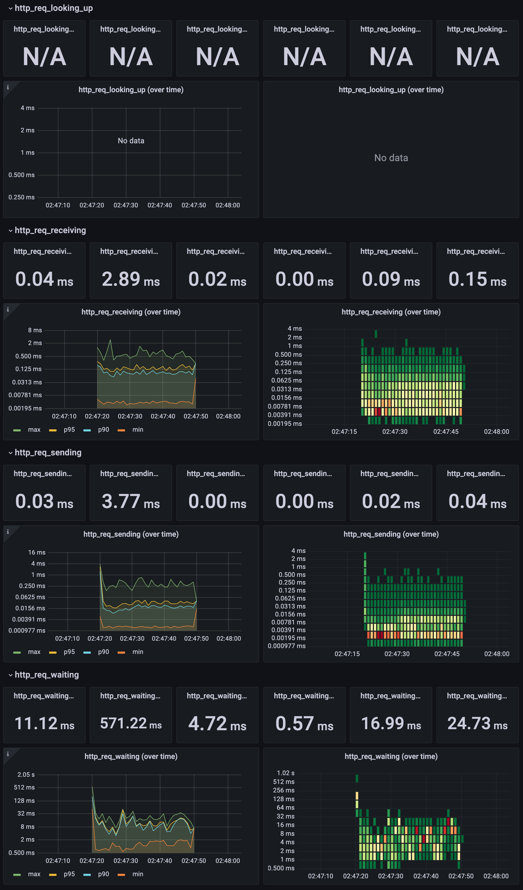

# Cache

## 목차
1. 캐시란?
2. 캐싱 전략
3. 캐시 스탬피드
4. 활용 방안

---

## 1. 캐시란?
캐시란 데이터의 원본보다 더 빠르고 효율적으로 엑세스할 수 있는 임시 데이터 저장소를 의미합니다.
사용자가 동일한 데이터를 반복적으로 접근할 때 원본 데이터베이스가 아닌 캐시에서 데이터를 가지고 옴으로써 리소스를 줄일 수 있습니다.

### 캐시를 도입했을 때 성능을 효과적으로 개선할 수 있는 조건
- 원본 데이터베이스에서 데이터를 찾는 시간이 오래 걸리거나 매번 계산을 통해 데이터를 가져와야 할 때
- 캐시에 저장된 데이터가 자주 검색되는 데이터일 때
- 캐시에 저장된 데이터가 잘 변하지 않는 데이터일 때
- 캐시에서 데이터를 가져오는것이 원본 데이터베이스에서 가져오는 것 보다 빠를 때

위 조건들을 만족시키면 원본 데이터베이스에서 데이터를 읽는 커넥션을 줄일 수 있고 애플리케이션의 응답 속도를 줄일 수 있어 확장 또한 가능합니다.

---

## 2. 캐싱 전략
## 1)  읽기 전략 - Look Aside

### 장점
- 캐시에 문제가 생겨 접근할 수 없는 상황이 발생해도 원본 데이터베이스에서 데이터를 가지고 올 수 있습니다.
### 단점
- 기존에 애플리케이션에서 캐시로부터 조회해오는 데이터가 많거나  원본 데이터베이스로 한꺼번에 커넥션이 몰려 부하를 발생시킬 수 있습니다.
- 기존 서비스에 캐시를 새로 도입하는 상황이라면 캐시 미스가 발생하여 애플리케이션은 매번 원본 데이터베이스에 접근해야 하기 때문에 부하가 급증 할 수 있습니다.

### 캐시 워밍(Cache Warming)
새로운 콘서트를 등록하고 예매를 오픈했을 때 사용자들이 예매하기 버튼이 있는 콘서트 상세 페이지에 접근한다면 트래픽이 급증하고 캐시 미스가 발생합니다. 이 경우 콘서트 상세 데이터를 캐시에 밀어넣는 캐시 워밍 작업을 하는것이 효율적입니다.

## 2)  쓰기 전략 - Write Through
원본 데이터베이스에 업데이트를 할 때 매번 캐시도 함께 업데이트를 시키는 방식입니다.

### 장점
- 캐시가 항상 최신 데이터를 가지고 있습니다.

### 단점
- 매번 2개의 저장소에 저장되어야 하기 때문에 쓰기에 시간이 많이 소요됩니다.
- 캐시는 다시 사용될 수 있는 데이터가 저장되는 것이 좋지만 이 방법의 경우 다시 사용되지 않을 데이터일 수도 있기 때문에 리소스 낭비가 발생할 수 있습니다. 따라서 이 경우에는 만료 시간을 사용하는 것을 권장합니다.

## 3)  쓰기 전략 - Cache Invalidation
데이터베이스에 값을 업데이트할 때마다 캐시 데이터를 삭제하는 전략입니다. 캐시 데이터를 삭제하는 것이 새로운 데이터를 저장하는 것 보다 리소스를 훨씬 적게 사용하기 때문에 Write Through의 단점을 보완한 방법이라고 볼 수 있습니다.

## 4)  쓰기 전략 - Write Behind(Write Back)
쓰기가 빈번하게 발생하는 서비스일때 고려해볼 수 있는 전략입니다. 데이터를 먼저 캐시에 저장하고 특정 건수나 특정 시간 간격에 따라 비동기적으로 데이터베이스에 업데이트를 합니다.
동영상 좋아요와 같이 매번 실시간 집계가 필요하지 않아 저장되는 데이터가 실시간으로 정확하지 않아도 될 경우 이 전략이 유용합니다.

---

## 3. 캐시 스탬피드
대규모 트래픽 환경에서 키에 대해 만료 시간을 어떻게 설정하느냐에 따라서 캐시 스탬피드 상황이 발생할 수 있습니다. 여러개의 애플리케이션에서 바라보던 키가 만료되면 이 서버들은 한꺼번에 원본 데이터베이스에서 데이터를 읽어오게 됩니다.(중복 읽기) 그리고 각 애플리케이션에서 읽어온 데이터를 캐시에 저장하게 되는데 이 또한 반복되어 중복 쓰기가 발생됩니다.

### 해결 방안
- 적절한 만료 시간 설정
    - 여러 애플리케이션이 바라보는 데이터이고 반복적으로 사용되어야하는 데이터라면 만료 시간을 충분히 길게 설정해야합니다.
- 선 계산
    - 키가 만료되기 전 이 값을 미리 갱신해주면되는데 랜덤한 확률로 원본 데이터베이스에 접근해 캐시의 값을 갱신합니다.
- PER 알고리즘
    - 확률적 조기 재계산 알고리즘으로 캐시 값이 만료되기 전에 언제 원본 데이터베이스에 접근해서 데이터를 읽어오면 되는지 최적으로 계산하는 알고리즘입니다.
    - 만료 시간이 점점 다가올수록 캐시를 갱신할 확률이 높아집니다.
  > - currentTime - ( timeToCompute * beta * log(rand)) ) > expiry
  > - currentTime: 현재 시간
  > - timeToCompute: 캐시된 값을 다시 계산하는데 걸리는 시간
  > - beta: 기본적으로 1.0보다 큰 값으로 설정 가능
  > - rand(): 0과 1 사이의 랜덤 값을 반환하는 함수
  > - expiry: 키를 재설정할 때 새로 넣어줄 만료 시간

---

## 4. 활용 방안
### 콘서트 정보 조회
23년 아이유 콘서트가 선 예매 오픈을 했을때 동시 접속자 수가 35만명이었다고 합니다. 예매하기 버튼이 있는 콘서트 상세 페이지에 접근한다면 트래픽이 급증할 것이고 콘서트 정보는 빈번하게 수정되지 않기 때문에 캐시를 사용하기에 적합한 상황입니다.

Redis의 `@Cacheable` 어노테이션의 읽기/쓰기 전략은 Look-Aside/Write-Around 전략을 조합하여 사용합니다. 가장 일반적으로 쓰이는 조합으로 사용하였습니다.

### 캐시 적용 전 VS 캐시 적용 후 성능 비교
k6로 초당 500개의 요청을 30초간 진행하는 부하 테스트를 진행하여 비교하였습니다.

|                       |              |              |         |                      |
| --------------------- | ------------ | ------------ | ------- | -------------------- |
| **지표**                | **적용** **전** | **적용** **후** | **개선률** | **분석**               |
| **평균** **요청** **지속시간** | 17.05ms      | 11.18ms      | ▼34.4%  | 전체적인 처리 속도 대폭 향상     |
| **p90** **응답시간**      | 45.1ms       | 17.06ms      | ▼62.2%  | 상위 10% 사용자 경험 극적 개선  |
| **p95** **응답시간**      | 74.81ms      | 24.76ms      | ▼66.9%  | 상위 5% 요청 처리 효율 3배 향상 |
| **최대** **응답시간**       | 627.12ms     | 572.78ms     | ▼8.7%   | 극단적 지연 사례 감소         |
| **초당 처리량(RPS)**       | 488.92/s     | 485.42/s     | ▼0.7%   | 처리량 유지 수준            |
| **TCP** **연결** **시간** | 2.32ms (평균)  | 1.95ms (평균)  | ▼15.9%  | 네트워크 효율 개선           |
| **데이터** **송신** **시간** | 88µs (평균)    | 25.58µs (평균) | ▼70.9%  | 패킷 전송 최적화 성공         |
| **중앙값(med) 응답시간**     | 5.09ms       | 4.77ms       | ▼6.3%   | 일반 사용자 체감 속도 향상      |

주요 개선사항으로 응답시간이 극적으로 감소하였습니다.
- **p95 응답시간 66.9% 개선** (74.81ms → 24.76ms)
-  **최대 지연시간 627ms → 572ms**로 55ms 단축
-  90% 이상의 요청이 **17ms 이내** 완료 (기존 45ms)

### 캐시 적용 전

### 캐시 적용 후

## 결론
캐시 적용으로 모든 핵심 성능 지표가 개선되었습니다. 특히 상위 5% 사용자 경험(p95)이 74ms에서 24ms로 3배 이상 빨라졌고 네트워크 효율성 개선과 함께 시스템 전반의 안정성이 크게 향상되었습니다.

## 참고
https://loosie.tistory.com/800
 
https://inpa.tistory.com/entry/REDIS-%F0%9F%93%9A-%EC%BA%90%EC%8B%9CCache-%EC%84%A4%EA%B3%84-%EC%A0%84%EB%9E%B5-%EC%A7%80%EC%B9%A8-%EC%B4%9D%EC%A0%95%EB%A6%AC#write_around_%ED%8C%A8%ED%84%B4
