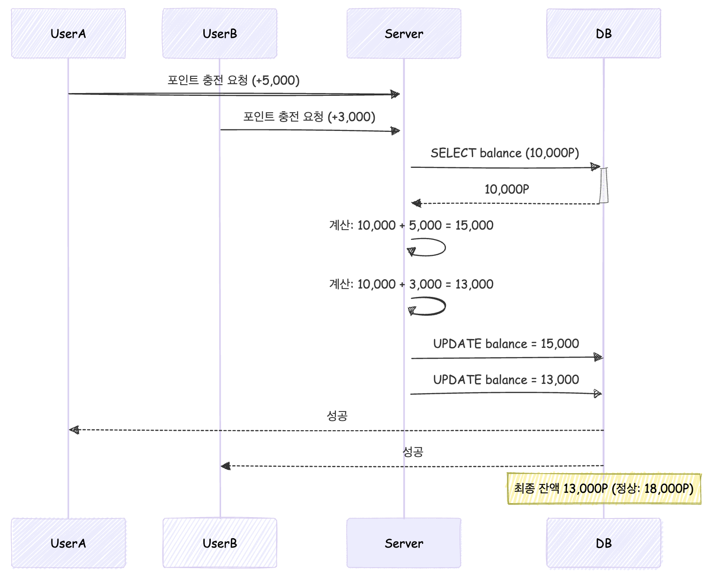

# 동시성 문제 사례 분석 및 해결 방안 보고서

## 목차
1. 문제 재현 시나리오
    1. 좌석 예약
    2. 포인트 충전/사용
2. 해결 방안

---

## 1. 🚨 문제 재현 시나리오

### 1) 좌석 예약


### 2) 포인트 충전/사용



---

## 2. 해결 방안

## 2.1 좌석 예약

## 1) 비관적 락 (Pessimistic Lock)

### 🔒 메커니즘

| 장점               | 단점                          |
| ---------------- | --------------------------- |
| - 강력한 데이터 정합성 보장 | - 데드락 발생 가능성                |
| - 재시도 로직 불필요     | - X-Lock (배타적 잠금) 동시 처리량 감소 |

### 📊 50건 동시 요청 테스트 결과

| 항목       | 값        |
| -------- | -------- |
| 전체 소요 시간 | 221ms    |
| 최소 처리 시간 | 119ms    |
| 평균 처리 시간 | 142.08ms |
| 최대 처리 시간 | 153ms    |

---

## 2) 낙관적 락 (Optimistic Lock)

### 🔄 메커니즘

트랜잭션 커밋 시 버전 충돌을 검사하고 충돌이 발생하면 `OptimisticLockException`이 반환되어 재시도 처리 로직이 필요합니다.

```java
@Entity
public class Seat {
	@Version
	private Long version; // 버전 관리 필드
}
```

`@Retryable`을 사용하면 간단하게 재시도 처리를 구현할 수 있습니다.
<br>
하지만 좌석이 선점되면 이후 요청은 실패해야 하기 때문에 재시도 처리 필요 없이 구현할 수 있었습니다.

```java
@Retryable(value = OptimisticLockException.class, 
           maxAttempts = 3, 
           backoff = @Backoff(delay = 50))
public void reserve() {
    // 비즈니스 로직
}
```

| 장점           | 단점             |
| ------------ | -------------- |
| - 데드락 리스크 없음 | - 재시도 로직 필수 구현 |

### 📊 50건 동시 요청 테스트 결과

| 항목       | 값        |
| -------- | -------- |
| 전체 소요 시간 | 222ms    |
| 최소 처리 시간 | 112ms    |
| 평균 처리 시간 | 149.84ms |
| 최대 처리 시간 | 178ms    |

---

## 3-1) 분산락 - Simple Lock

분삭락은 [풀필먼트 입고 서비스팀에서 분산락을 사용하는 방법](https://helloworld.kurly.com/blog/distributed-redisson-lock)를 참고하여 구현하였습니다.

### 🚨 짧은 TTL 설정으로 인한 중복 예약 문제 발생

동일 좌석에 대한 동시 예약 요청 시 `@DistributedLock`의 짧은 TTL 설정으로 인해 동시 예약 문제가 발생했습니다.

### 📝 문제 재현 시나리오

### 실패 케이스 (TTL = 3)

```java
@DistributedLock(key = "#command.seatId()", leaseTime = 3) 
public ReservationInfo.Create reserve(ReservationCommand.Create command) {
}
```

| 순서  | 스레드 A                             | 스레드 B      |
| --- | --------------------------------- | ---------- |
| 1   | 락 획득                              | -          |
| 2   | 트랜잭션 시작                           | -          |
| 3   | 예약 로직 수행                          | -          |
| 4   | TTL 만료                            | 락 획득       |
| 5   | 트랜잭션 커밋 완료                        | 트랜잭션 시작    |
| 6   | `Redisson Lock Already UnLock` 에러 | 예약 로직 수행   |
| 7   | -                                 | 트랜잭션 커밋 완료 |
| 8   | -                                 | 락 정산 반납    |

### ✅ 해결 방안

### 적절한 TTL 설정

| 설정 값   | 결과  |
| ------ | --- |
| 3초     | 실패  |
| 4초     | 실패  |
| **5초** | 성공  |

### 📊 50건 동시 요청 테스트 결과

| 항목       | 값        |
| -------- | -------- |
| 전체 소요 시간 | 635ms    |
| 최소 처리 시간 | 108ms    |
| 평균 처리 시간 | 346.74ms |
| 최대 처리 시간 | 601ms    |

---

## 3-2) 분산락 - Spin Lock

### 🚨 클래스 레벨 @Transactional(readOnly = true) 선언으로 인한 커넥션 부족 문제 발생

### 📝 문제 재현 시나리오

1. 클래스 레벨 @Transactional(readOnly = true) : 모든 public 메서드가 읽기 전용 트랜잭션으로 실행되며, 커넥션 50개 (Hikari 풀 크기)를 선점합니다.
2. 분산락 AOP에서 REQUIRES_NEW 사용 : 락 획득 후 새로운 물리 트랜잭션을 시작하여 추가 커넥션이 필요하였고 커넥션 부족 오류가 발생하였습니다.

### ✅ 해결 방안

모든 메서드에 트랜잭션이 강제 적용되어 의도하지 않은 커넥션 사용이 증가되었고 메서드 레벨로 명시적으로 설정하여 해결하였습니다.

```
// ❌ 클래스 레벨 사용 X
// @Transactional(readOnly = true)
public class MyService {
    
    // ⭕ 메서드 레벨로 명시적 설정
    @Transactional(readOnly = true)
    public void readMethod() { ... }
}

```

### 📊 50건 동시 요청 테스트 결과

| 항목       | 값         |
| -------- | --------- |
| 전체 소요 시간 | 49583ms   |
| 최소 처리 시간 | 351ms     |
| 평균 처리 시간 | 24869.9ms |
| 최대 처리 시간 | 49540ms   |

---

## 📌 결론

Simple Lock과 Optimistic Lock 중 TTL 설정 리스크가 필요없는 Optimistic Lock을 채택하였습니다.