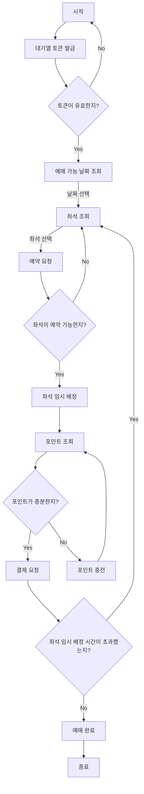

# 플로우 차트

```mermaid
flowchart TD
A[시작] --> B[대기열 토큰 발급]
B --> C{토큰이 유효한지?}
C -->|Yes| D[예매 가능 날짜 조회]
C -->|No| A
D -- 날짜 선택 --> F[좌석 조회]
F -- 좌석 선택 --> G[예약 요청]
G --> H{좌석이 예약 가능한지?}
H -->|Yes| I[좌석 임시 배정]
H -->|No| F
I --> J[포인트 조회]
J --> K{포인트가 충분한지?}
K -->|Yes| L[결제 요청]
K -->|No| M[포인트 충전]
M --> J
L --> N{좌석 임시 배정 시간이 초과했는지?}
N -->|No| O[예매 완료]
N -->|Yes| F
O --> P[종료]
```