# 인덱스 적용 보고서

## 목차
1. 인덱스
2. 자주 조회하는 쿼리 파악
3. 인덱스 적용 전후 실행시간 비교
4. 복합 인덱스(시나리오 추가)
5. 결론

---

## 1. 인덱스

### Clustered Index와 Non-Clustered Index

- Clustered Index: 특정 column을 primary key로 지정하면 자동으로 클러스터형 인덱스가 생성되고 해당 column을 기준으로 정렬이 됩니다. Table 자체가 정렬된 하나의 index인 것입니다. 영어사전처럼 책의 내용 자체가 정렬된 것으로 생각할 수 있습니다.
- Non-Clustered Index: 일반적인 책의 찾아보기와 같이 별도의 공간에 인덱스가 생성됩니다. `create index`와 같이 index를 생성하거나 unique key로 지정하면 보조 인덱스가 생성됩니다.

---

## 2. 자주 조회하는 쿼리 파악

Non-Clustered Index로 설정할 수 있는 쿼리들을 찾아보았습니다.

-  콘서트 아이디로 콘서트 일정 목록 조회
-  사용자 아이디로 포인트 정보 조회

---

## 3. 인덱스 적용 전후 실행시간 비교

테스트는 총 **콘서트 데이터 10,000건**과 **콘서트 일정 데이터 100,000건**을 기반으로 수행되었습니다. 각 콘서트는 10개의 일정을 가집니다.

### 1) 콘서트 아이디로 콘서트 일정 목록 조회

```java
List<ConcertSchedule> concertSchedules = concertScheduleRepository.findAllByConcertId(concertId);
```

### 🔎 DB에서 확인

```sql
select * from concert_schedule where concert_id = 5555;
```

### 적용 전

### Explain Plan
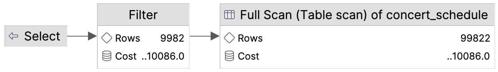

### Explain Analyse


1. Full Scan
    - 예상 처리 행 수(Rows): 99,822
    - 실제 반환된 행 수(Actual Rows): 테이블의 모든 행(100,000개)을 읽었습니다.
    - 실제 소요 시간(Actual Time): 최소 2.19ms ~ 최대 44ms
2. Filter
    - 예상 처리 행 수(Rows): 9982
    - 실제 반환된 행 수(Actual Rows): 10개
    - 실제 소요 시간(Actual Time): 최소 29ms ~ 최대 49.7ms

> - 예상 비용(Cost)은 데이터베이스 실행 계획에서 각 단계의 상대적인 작업 비용을 나타내는 값으로, 쿼리가 실행될 때 해당 작업이 얼마나 "비용이 많이 드는지"를 예측하는 데 사용됩니다. 이 값은 CPU, 디스크 I/O, 메모리 사용량 등을 기반으로 계산되며, 쿼리 최적화를 위해 중요한 지표입니다.
> - Filter 단계에서도 동일한 총 비용(10,073.0)이 표시됩니다.
> -  이는 Filter가 Full Scan 이후에 수행되며, Filter 자체가 추가적인 I/O 작업을 요구하지 않기 때문입니다.
> - 따라서 Filter 단계의 비용은 Full Scan 단계의 총 비용과 동일하게 나타납니다.

### 적용 후

### Explain Plan
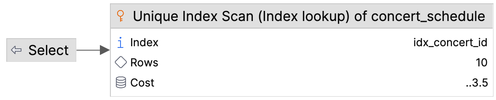

### Explain Analyse
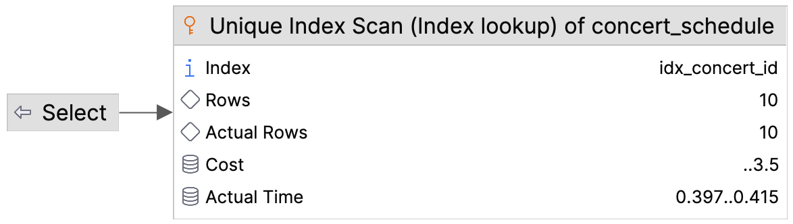

### 📊 인덱스 적용 전후 비교

| 항목       | 인덱스 미적용(Full Table Scan) | 인덱스 적용(Unique Index Scan) |
| -------- | ------------------------ | ------------------------- |
| 스캔 방식    | Full Table Scan          | Unique Index Scan         |
| 처리 행 수   | 약 100,000행 전체 스캔         | 조건에 맞는 단일 행(10개)          |
| 예상 비용    | 10,086                   | 3.5                       |
| 실제 반환 시간 | 약 50ms                   | 약 0.4ms                   |

### 🔎 k6 부하테스트로 확인

🔥 초당 500개의 요청을 30초간 진행하는 부하 테스트를 진행하여 비교하였습니다.

### 적용 전
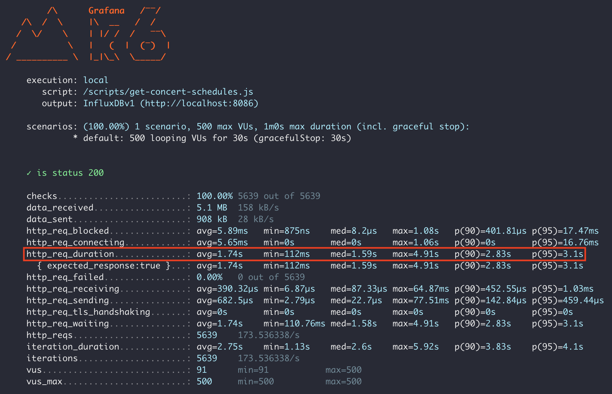

### 적용 후


### 📊 핵심 지표 비교

| 지표            | 인덱스 미적용         | 인덱스 적용       | 분석                  |
| ------------- | --------------- | ------------ | ------------------- |
| 총 요청 수        | 5,639 요청        | 13,976 요청    | 처리량이 약 148% 증가      |
| 평균 요청 시간      | 1.74초 (1,740ms) | 82.07ms      | 요청 시간이 약 95% 단축     |
| 최소 요청 시간      | 112ms           | 2.08ms       | 최소 응답 시간이 약 98% 단축  |
| 최대 요청 시간      | 4.91초           | 1.23초        | 최대 응답 시간이 약 75% 단축  |
| P90 요청 시간     | 2.83초           | 278.73ms     | P90 응답 시간이 약 90% 단축 |
| P95 요청 시간     | 3.10초           | 420.07ms     | P95 응답 시간이 약 86% 단축 |

### ✅ 개선된 영역

- 처리량이 **약 148% 증가**되었습니다.
- 평균 요청 시간이 **약 95% 단축**되었습니다.
- 최소 응답시간이 **약 98% 단축**되었습니다.
- 최대 응답시간이 **약 75% 단축**되었습니다.

---

### 2) 사용자 아이디로 포인트 정보 조회

테스트는 총 **사용자-포인트 데이터 100,000건**을 기반으로 수행되었습니다. 각 사용자와 포인트는 1:1 매핑 관계를 가집니다.

```java
Point point = pointRepository.findByUserId(userId)
```

### 🔎 DB에서 확인

```sql
select * from point where user_id = 55555;
```

### 적용 전

### Explain Plan


### Explain Analyse
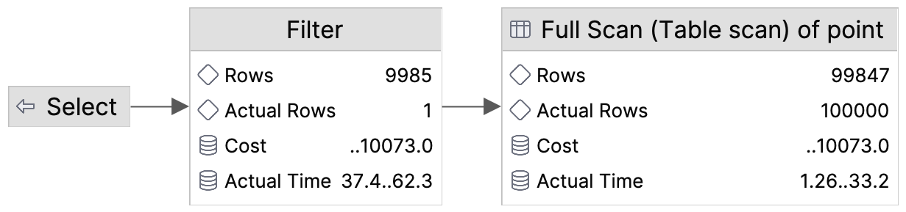

1. Full Scan
    - 예상 처리 행 수(Rows): 99,847
    - 실제 반환된 행 수(Actual Rows): 테이블의 모든 행(100,000개)을 읽었습니다.
    - 실제 소요 시간(Actual Time): 최소 1.26ms ~ 최대 33.2ms
2. Filter
    - 예상 처리 행 수(Rows): 9985
    - 실제 반환된 행 수(Actual Rows): 1개
    - 실제 소요 시간(Actual Time): 최소 37.4ms ~ 최대 62.3ms

### 적용 후

### Explain Plan


### Explain Analyse
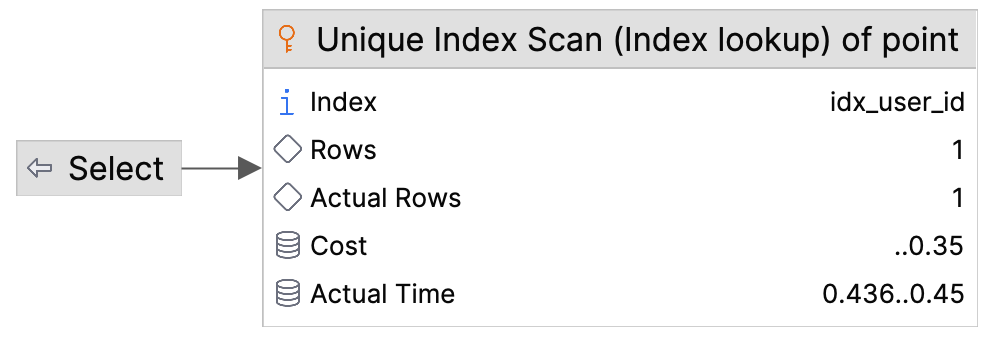

### 📊 인덱스 적용 전후 비교

| 항목       | 인덱스 미적용(Full Table Scan) | 인덱스 적용(Unique Index Scan) |
| -------- | ------------------------ | ------------------------- |
| 스캔 방식    | Full Table Scan          | Unique Index Scan         |
| 처리 행 수   | 약 100,000행 전체 스캔         | 조건에 맞는 단일 행(1개)           |
| 예상 비용    | 10,073                   | 0.35                      |
| 실제 반환 시간 | 약 62ms                   | 약 0.44ms                  |

### 🔎 k6 부하테스트로 확인

🔥 초당 500개의 요청을 30초간 진행하는 부하 테스트를 진행하여 비교하였습니다.

### 적용 전


### 적용 후
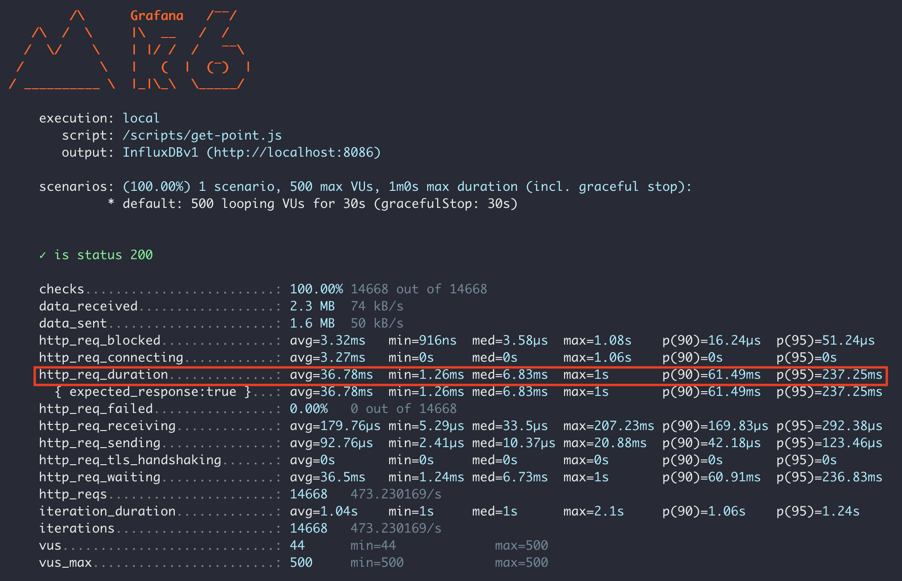

### 📊 핵심 지표 비교

| 지표        | 인덱스 미적용  | 인덱스 적용    | 분석                  |
| --------- | -------- | --------- | ------------------- |
| 총 요청 수    | 8,036 요청 | 14,668 요청 | 처리량이 약 82.5% 증가     |
| 평균 요청 시간  | 889.64ms | 36.78ms   | 요청 시간이 약 96% 단축     |
| 최소 요청 시간  | 60.64ms  | 1.26ms    | 최소 응답 시간이 약 95% 단축  |
| 최대 요청 시간  | 4.15초    | 1초        | 최대 응답 시간이 약 76% 단축  |
| P90 요청 시간 | 1.38초    | 61.49ms   | P90 응답 시간이 약 95% 단축 |
| P95 요청 시간 | 1.65초    | 237.25ms  | P95 응답 시간이 약 86% 단축 |

### ✅ 개선된 영역

- 처리량이 **약 82.5% 증가**되었습니다.
- 평균 요청 시간이 **약 96% 단축**되었습니다.
- 최소 응답시간이 **약 95% 단축**되었습니다.
- 최대 응답시간이 **약 76% 단축**되었습니다.

---

## 4. 복합 인덱스

복합 인덱스를 효율적으로 테스트할 수 있도록 시나리오를 만들어서 테스트를 진행하였습니다.

- 콘서트 예약 서비스에서 특정 기간 동안 예약 상태가 `CANCELLED`인 예약 건수를 콘서트별로 집계해야 합니다.
- 테스트 데이터는 고척돔에서 2025년 2월 동안 매일 콘서트를 연다는 가정하에 생성되었습니다.
    - 고척돔 수용 인원: 20,000명
    - 28일 동안 총 560,000건의 예약 데이터 생성
    - 예약 일시(`reservation_at`)와 상태(`status(CANCELLED, CONFIRMED, PAYMENT_PENDING)`)는 랜덤으로 설정

### 테스트 쿼리

```sql
select concert_id, count(*) from reservation  
where status = 'CANCELLED'  
and reservation_at between '2025-02-11 00:00' and '2025-02-13 23:59:59'  
group by concert_id  
order by count(*) desc;
```

### 1) 인덱스: `reservation_at, status`

```sql
create index idx_reservation on reservation (reservation_at, status);
```

### 🚧 실행계획

| type  | ref | extra                                                  |
| ----- | --- | ------------------------------------------------------ |
| range | -   | Using index condition; Using temporary; Using filesort |

### 🔎 분석


- `reservation_at BETWEEN` 조건으로 인덱스 범위 스캔이 수행되었습니다.
- 하지만 `status`는 인덱스에서 효율적으로 활용되지 않았습니다.
- `concert_id`로 그룹화(`GROUP BY`)와 `COUNT(*)` 계산 후 정렬(`ORDER BY`, filesort)하며 임시 테이블(temporary)이 생성되었습니다.

🔥 k6로 초당 500개의 요청을 30초간 진행하는 부하테스트를 진행했습니다.

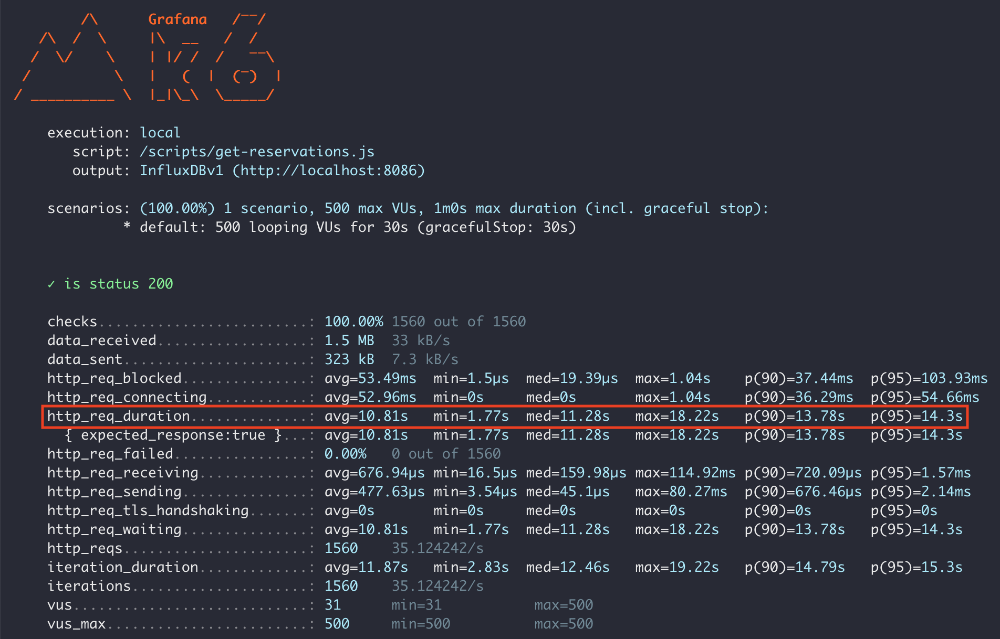

### 2) 인덱스: `status, reservation_at`

### 🚧 실행계획

| type  | ref | extra                                                  |
| ----- | --- | ------------------------------------------------------ |
| range | -   | Using index condition; Using temporary; Using filesort |

### 🔎 분석

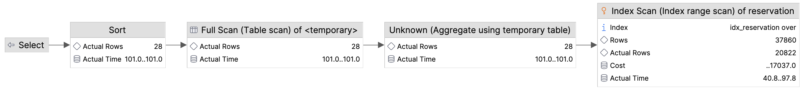

`status = 'CANCELLED'` 조건을 선행 컬럼으로 처리하여 수행 시간이 이전보다 조금 빨라졌습니다.

🔥 k6로 초당 500개의 요청을 30초간 진행하는 부하테스트를 진행했습니다.

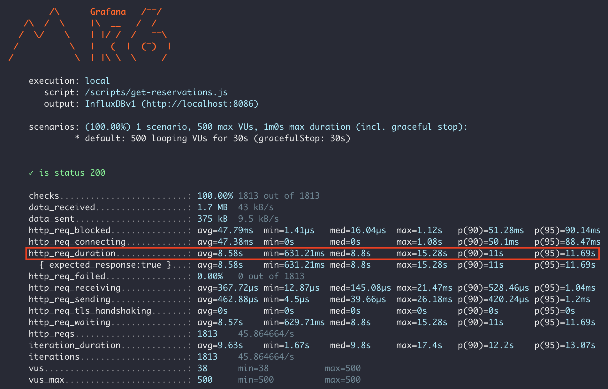

### 3) 인덱스: `status, reservation_at, concert_id`

### 🚧 실행계획

| type  | ref | extra                                                     |
| ----- | --- | --------------------------------------------------------- |
| range | -   | Using where; Using index; Using temporary; Using filesort |

### 🔎 분석

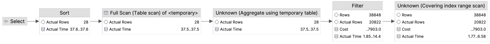

쿼리의 모든 조건이 인덱스 컬럼에 포함되어 있는 **커버링 인덱스**로 효율적으로 작동해 대폭 개선된 수행시간을 확인할 수 있습니다.

🔥 k6로 초당 500개의 요청을 30초간 진행하는 부하테스트를 진행했습니다.

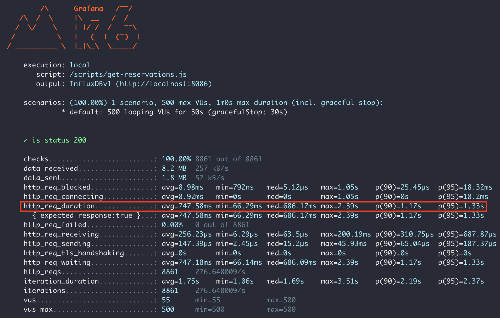

### 4) 인덱스: `status, concert_id`

### 🚧 실행계획

| type | ref | extra                                                               |
| ---- | --- | ------------------------------------------------------------------- |
| ref  | -   | Using index condition; Using where; Using temporary; Using filesort |

### 🔎 분석

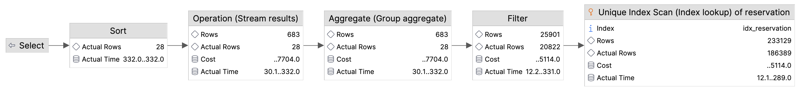

- `status = 'CANCELLED'` 조건을 선행 컬럼으로 처리하여 기본 필터링이 수행되었습니다.
- `reservation_at BETWEEN` 조건은 인덱스로 처리되지 않고 추가적인 필터링 단계에서 처리되었습니다.

🔥 k6로 초당 500개의 요청을 30초간 진행하는 부하테스트를 진행했습니다.

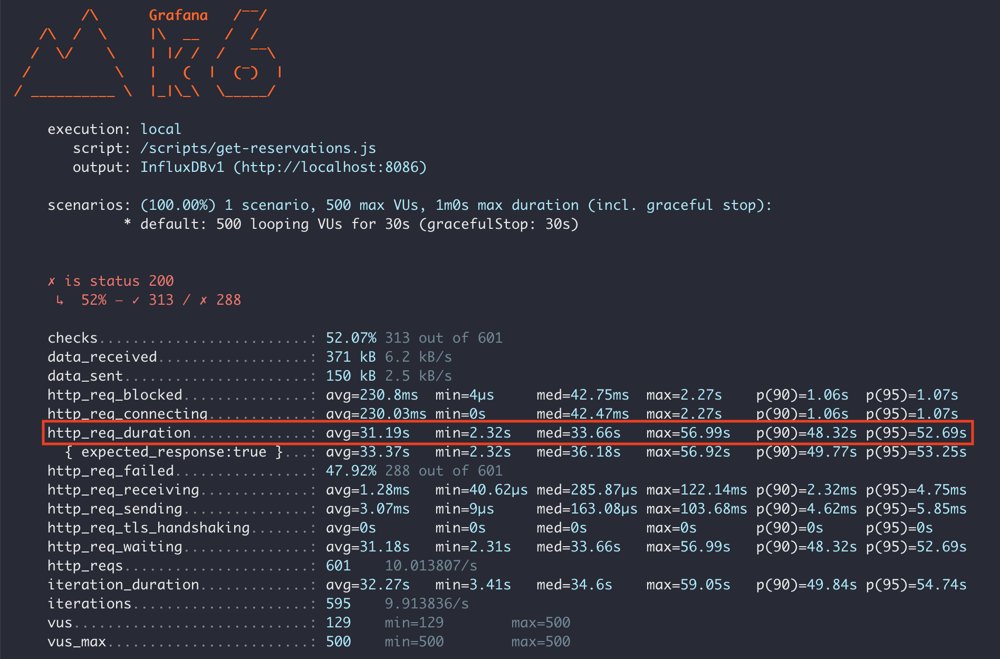

### 5) 인덱스: `status, concert_id, reservation_at`

### 🚧 실행계획

| type | ref | extra                                                               |
| ---- | --- | ------------------------------------------------------------------- |
| ref  | -   | Using index condition; Using where; Using temporary; Using filesort |

### 🔎 분석

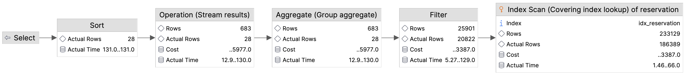

모든 조건(`status`, `concert_id`, `reservation_at`)이 인덱스를 통해 처리되었습니다.

🔥 k6로 초당 500개의 요청을 30초간 진행하는 부하테스트를 진행했습니다.

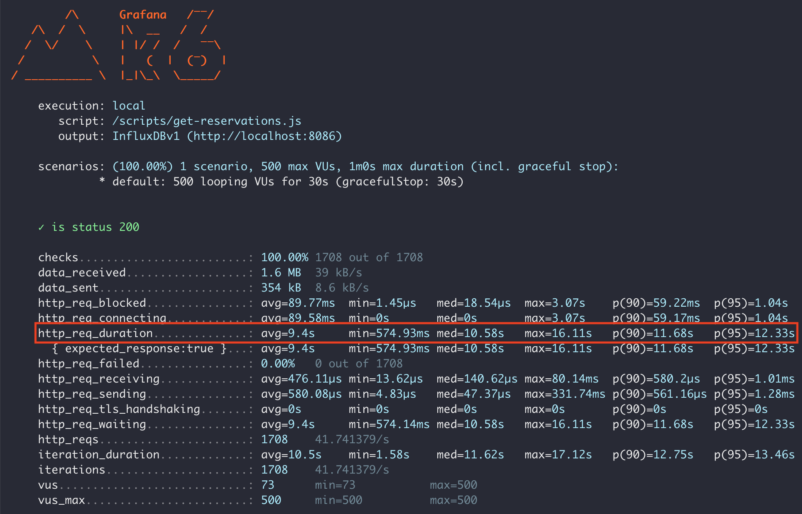

### ✅ 정리

| 인덱스                                | 주요 특징                                                  |
| ---------------------------------- | ------------------------------------------------------ |
| reservation_at, status             | reservation_at 범위 조건은 처리했지만 status는 효율적으로 활용되지 못했습니다.  |
| status, reservation_at             | status 조건을 선행 처리하여 효율성 향상시켰습니다.                        |
| status, reservation_at, concert_id | 커버링 인덱스로 모든 조건을 처리하였고 가장 효율적입니다.                       |
| status, concert_id                 | 기본 필터링은 효율적이나 추가 필터링(reservation_at)이 필요합니다.           |
| status, concert_id, reservation_at | 모든 조건을 효율적으로 처리했지만 인덱스 컬럼의 순서 차이로 3번째 인덱스보다 효율이 떨어집니다. |

가장 효율적인 인덱스는 `status, reservation_at, concert_id`로 쿼리의 모든 조건을 커버할 수 있어 데이터 접근이 가장 빠릅니다.

---

## 📌 결론

인덱스를 잘 활용한다면 **빠른 데이터 조회 속도**를 보장하며 **불필요한 전체 테이블 스캔을 제거**하여 서버 자원 사용량을 최적화 할 수 있습니다. 특히 현재 서비스의 데이터 분포 등을 파악하여 복합 인덱스를 효과적으로 설계한다면 다중 조건을 효율적으로 처리할 수 있어 쿼리 성능을 극대화할 수 있습니다.

---

## 참고
- https://medium.com/swlh/jetbrains-datagrip-explain-plan-ac406772c470
- https://frogcodepond.tistory.com/12
- https://jojoldu.tistory.com/476
- https://www.youtube.com/watch?v=ywYdEls88Sw
- https://www.youtube.com/watch?v=gcsu7ni3tBc&list=PLgXGHBqgT2TvpJ_p9L_yZKPifgdBOzdVH
