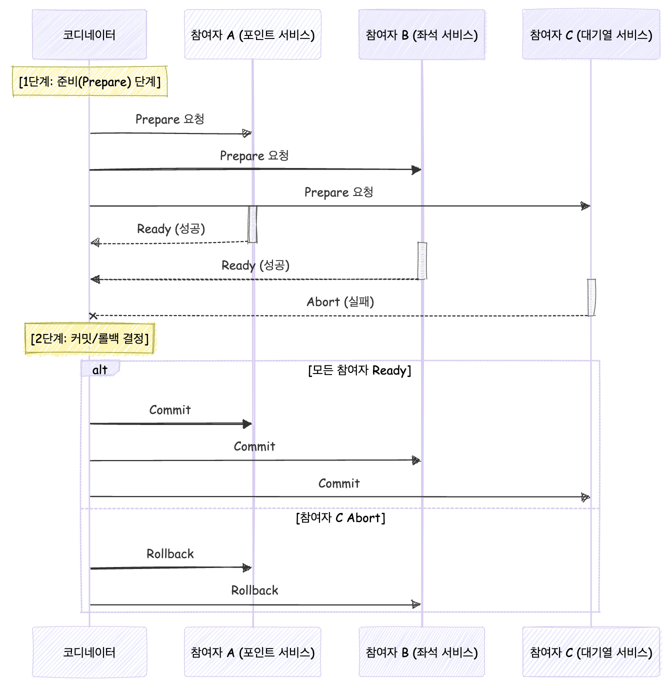
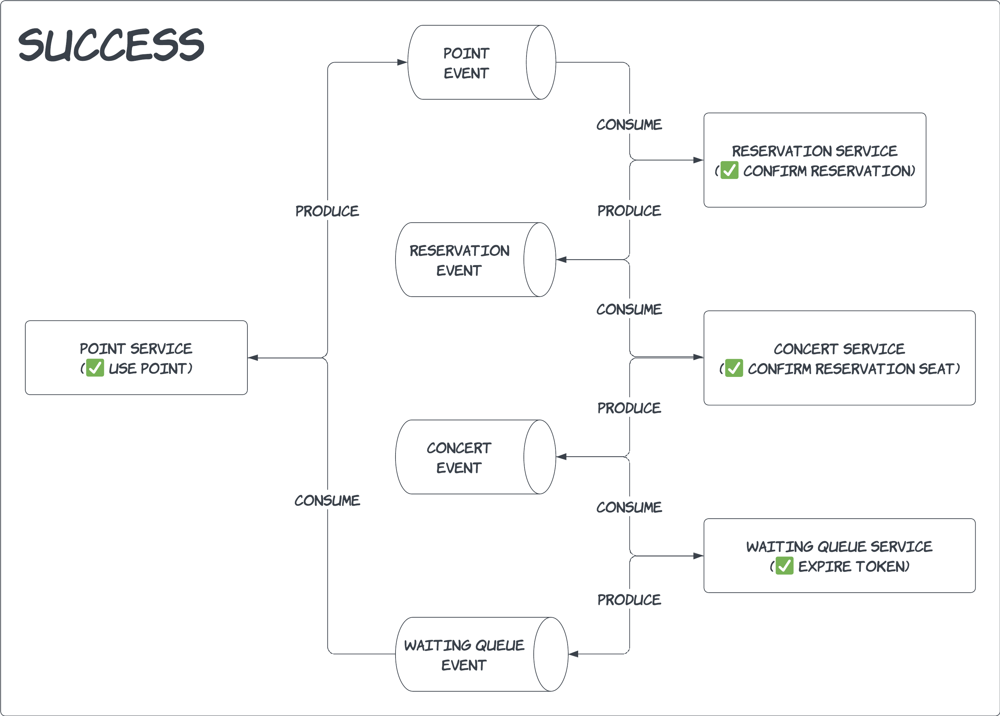
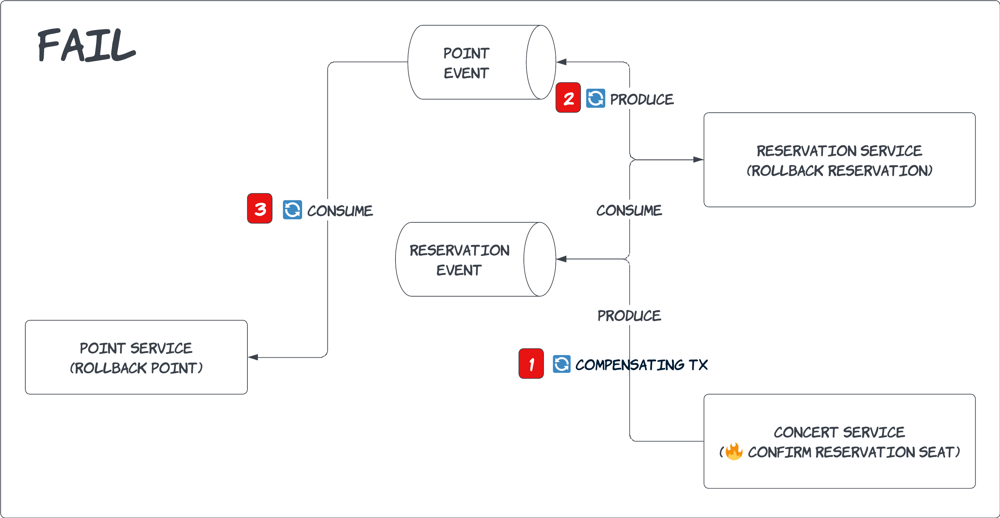
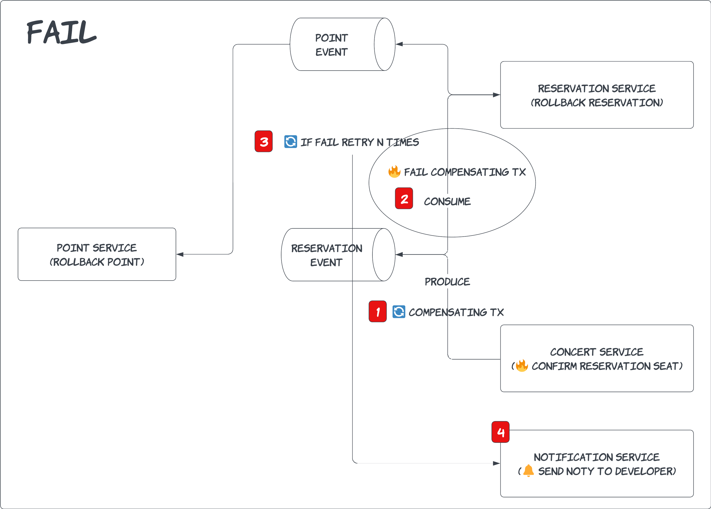
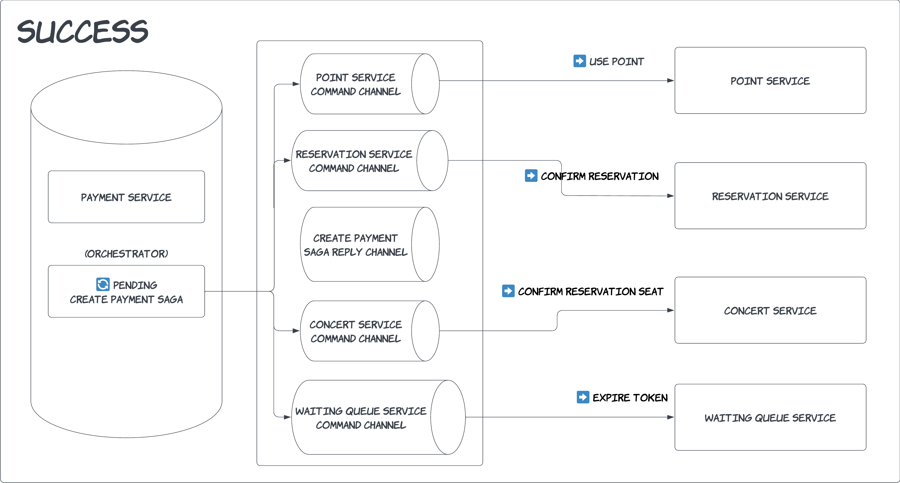
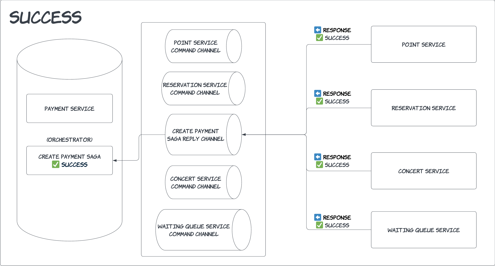
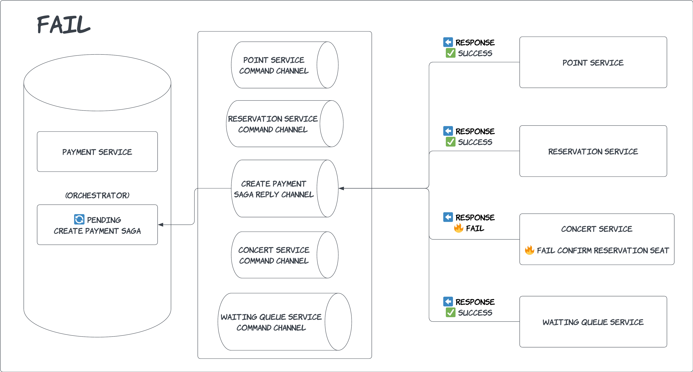
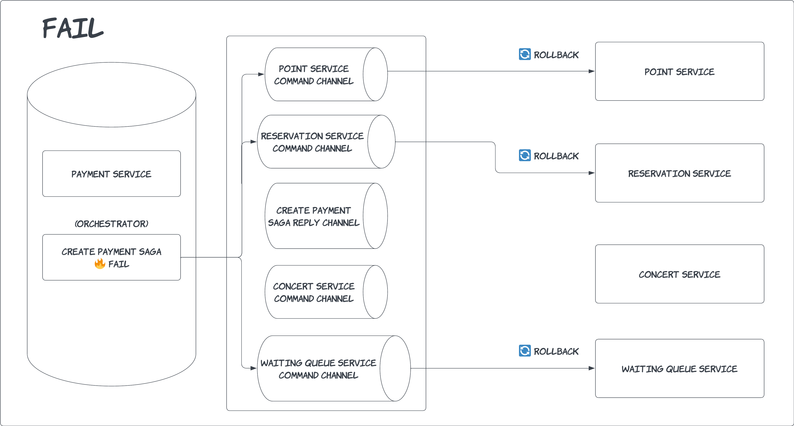

# 서비스의 규모가 확장되어 MSA의 형태로 각 도메인별로 배포단위를 분리해야한다면 그 분리에 따른 트랜잭션 처리의 한계와 해결방안

## 목차
1. 트랜잭션 처리 한계
2. 해결 방안
	1. 2PC(Two-Phase Commit)
	2. Saga 패턴
		1. 코레오그라피(ChoreoGraphy)
		2. 오케스트레이션(Orchestration)

---

## 1. 트랜잭션 처리 한계

MSA는 핵심 원칙인 **독립성**과 **확장성**을 달성하기 위해 Database Per Service 패턴을 사용합니다.

> - Database Per Service 패턴
> - 각 서비스가 자체 데이터베이스를 갖춤으로써 스키마 변경이나 기술 스택 변경이 타 서비스에 영향을 미치지 않습니다.
> - 서비스별로 최적의 데이터베이스 선택이 가능합니다.
> - 트래픽이 집중된 서비스만 독립적으로 스케일 아웃 가능합니다.

하지만 MSA 환경에서 Database Per Service 패턴을 사용할 경우 분산 트랜잭션의 한계로 인해 다음과 같은 문제점들이 발생합니다.

### 1) 원자성(Atomicity) 보장 실패

각 서비스의 로컬 트랜잭션은 독립적으로 커밋되어 전체 트랜잭션의 원자성을 보장할 수 없습니다.

```
포인트 차감(성공) → 예약 확정(실패) -> 대기열 토큰 만료(미처리) 시 부분 커밋 발생
```

### 2) 장애 전파 및 타임아웃

네트워크 지연 및 서비스 장애로 인해 원자성 보장 실패와 마찬가지로 트랜잭션이 부분적으로만 완료될 수 있습니다.

```
1. 포인트 차감
2. 예약 확정 (네트워크 지연)
3. 타임아웃 발생 → 전체 롤백 시도
```

### 3) 보상 트랜잭션의 복잡성

보상 트랜잭션 실패 시 수동 개입이 필수적입니다.

```
1. 포인트 차감 (성공)
2. 예약 확정 (실패)
3. 보상 트랜잭션(포인트 롤백)도 실패
→ 수동 개입 필요
```

이처럼 분산 시스템의 특성상 데이터 일관성 유지, 트랜잭션 격리, 장애 복구 등에서 복잡성이 증가할 수 있습니다.

---

## 해결 방안

### 1. 2PC(Two-Phase Commit)

2PC는 분산 시스템 환경에서 트랜잭션의 원자성을 보장하기 위한 프로토콜로 여러 데이터베이스나 서비스에 걸친 트랜잭션이 모두 성공하거나 모두 실패할 수 있도록 하기 위해 사용됩니다.

역할
- 코디네이터(Coordinator): 트랜잭션의 전체 흐름을 제어하는 중앙 노드
- 참여자(Participant): 마이크로서비스와 같이 실제 작업을 수행하는 분산 노드



1. 준비 단계
	1. 코디네이터가 모든 참여자들에게 `Prepare` 메시지를 전송합니다.
	2. 각 참여자들은 로컬 트랜잭션을 실행하고 로그에 결과를 저장하고 Lock을 획득하여 데이터 변경을 차단합니다.
	3. 참여자들은 코디네이터에게 Ready 또는 Abort 응답을 전송합니다.
2. 커밋/롤백 결정
	1. 모든 참여자가 Ready로 응답하면 코디네이터가 모든 참여자들에게 Commit 명령을 전송합니다.
	2. 하나의 참여자라도 Abort로 응답하면 코디네이터가 모든 참여자들에게 Rollback 명령을 전송합니다.

### 장점

- 분산 환경에서 트랜잭션 실패 시 데이터 불일치를 방지할 수 있습니다.

### 단점

- 코디네이터 장애 시 전체 시스템이 중단될 수 있습니다.
- 장시간 잠금을 유지하면 성능 저하가 발생할 수 있습니다.
- 참여자 수가 증가하면 지연 시간이 증가될 수 있습니다.
- MongoDB 등 대부분 NoSQL은 지원하지 않습니다.

---

### 2. Saga 패턴

Saga 패턴은 분산 시스템 환경에서 여러 서비스에 걸친 트랜잭션의 데이터 일관성을 관리하기 위한 패턴입니다.
2PC는 모든 단계가 완료되기 전까지 Lock을 획득하여 데이터의 변경을 차단하여 즉시 일관성을 보장하는 반면 Saga 패턴은 중간 단계에서 데이터 불일치가 발생할 수 있으나 보상 트랜잭션을 통해 데이터를 롤백합니다.

### 1) 코레오그라피(ChoreoGraphy) 기반 Saga

코레오그래피 기반 Saga는 **이벤트 발행/구독**을 통해 서비스 간 트랜잭션을 조율하는 방식입니다. 각 서비스가 이벤트를 발행하고 다음 단계의 서비스가 이를 소비하며 트랜잭션을 이어가는 구조입니다.

### 결제 성공


1. 포인트 서비스에서 포인트 차감을 성공하고 결제 완료 이벤트를 발행합니다.
2. 예약 서비스에서 예약 확정에 성공하면 예약 완료 이벤트를 발행합니다.
3. 콘서트 서비스에서 좌석 예약 확정에 성공하면 콘서트 좌석 예약 완료 이벤트를 발행합니다.
4. 대기열 서비스에서 대기열 토큰을 만료시키고 대기열 만료 이벤트를 발행합니다.
5. 포인트 서비스에서 응답받습니다.

### 좌석 예약 확정 처리 중 장애 발생


1. 콘서트 서비스에서 좌석 예약 확정을 처리하다 장애가 발생해 보상 트랜잭션으로 예약 취소 이벤트를 발행합니다.
2. 예약 서비스에서 예약을 취소하고 포인트 롤백 이벤트를 발행합니다.
3. 포인트를 롤백합니다.

### 보상 트랜잭션 실패


1. 보상 트랜잭션으로 예약 취소 이벤트를 발행합니다.
2. 예약 서비스에서 예약 취소 중 장애가 발생하여 이벤트를 다시 큐에 넣습니다.
3. n번 재시도 처리 후 모두 실패하면 알림 서비스를 통해 개발자에게 노티를 전송합니다.

### 장점

- 이벤트 기반 비동기 처리로 인해 높은 트래픽을 처리할 수 있습니다.
- 새로운 서비스를 추가하거나 기존 서비스를 변경할 때 다른 서비스에 영향을 주지 않아 독립적으로 확장이 가능합니다.
- 중앙 오케스트레이터 없이도 동작 가능하므로 단일 장애점(Single Point of Failure)이 없습니다.

### 단점

- 분산된 시스템에서 이벤트가 여러 서비스를 거치므로 트랜잭션 상태를 추적하기 어렵습니다.
	- OpenTelemetry, Jaeger 같은 분산 추적 시스템 도입을 검토해 볼 수 있습니다.
- 이벤트 소비가 지연되거나 실패했을 때 재시도 로직 및 보상 트랜잭션을 각 서비스에서 개별적으로 구현해야하기 때문에 관리가 복잡합니다.

---

### 2) 오케스트레이션(Orchestration) 기반 Saga

오케스트레이션 기반 Saga는  코레오그래피 기반 Saga와 달리 중앙 오케스트레이터(Orchestrator)가 모든 트랜잭션 단계를 제어하며 각 서비스에 명령을 전달하고 결과를 수집하는 방식으로 중앙 집중식 제어를 통해 트랜잭션 흐름을 관리합니다.

### 결제 성공



1. 결제 서비스에서 PENDING 상태의 결제를 생성합니다.
2. 각각의 서비스에 명령을 요청합니다.
3. 응답을 수신받습니다.
4. 오케스트레이터가 결제를 승인합니다.

### 결제 실패



1. 콘서트 서비스에서 좌석 확정 처리 중 장애가 발생해 오케스트레이터가 실패를 응답받습니다.
2. 오케스트레이터가 다른 서비스들에게 롤백을 명령합니다.

|     | HTTP                            | Messaging (Kafka)                       |
| :-: | ------------------------------- | --------------------------------------- |
|  1  | 동기                              | 비동기                                     |
|  2  | 직관적, 비교적 구현이 간단                 | 서비스간 느슨한 결합                             |
|  3  | 추가적 에러 핸들링 필요<br>(5XX, timeout) | 메시지 브로커 레벨에서 에러 핸들링 지원<br> 및 결과적 정합성 보장 |
|  4  | Client에서 read timeout 두기 편함     | 응답/timeout 구현 복잡                        |

결제를 구현한다면 HTTP 동기 방식으로 구현할 필요가 없기 때문에 Messaging 방식으로 구현 할 것 같습니다.

- 단순한 워크플로우와 높은 확장성이 필요한 경우 → **코레오그래피 선택**
- 복잡한 비즈니스 로직과 상태 관리가 중요한 경우 → **오케스트레이션 선택**

---

## 📌 결론


- **Database Per Service 패턴**을 사용하는 MSA는 독립성과 확장성을 제공하지만 분산 트랜잭션의 원자성(Atomicity) 보장이 어려웠습니다.
- 해결 방안으로 **2PC**와 **SAGA** 패턴을 제시했습니다.
- 성능 및 확장성 문제로 인해 SAGA 패턴을 선택했습니다.
- **ChoreoGraphy** 기반 Saga와 **Orchestration** 기반 Saga 두 가지 구현 방식이 존재합니다.
- 비즈니스 요구사항에 따라 적합한 패턴을 선택해야 합니다.

---

## 참고
- https://devyonghee.github.io/theory/2022/09/24/orchestration-vs-choreography/
- https://www.youtube.com/watch?v=xpwRTu47fqY
