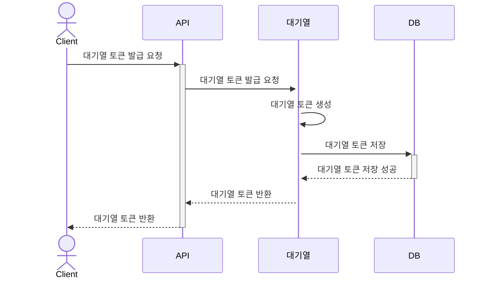
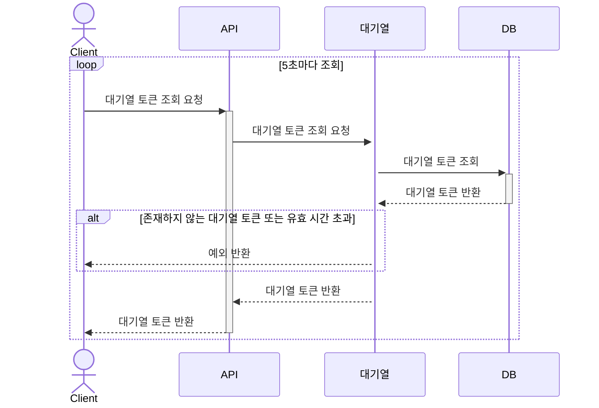
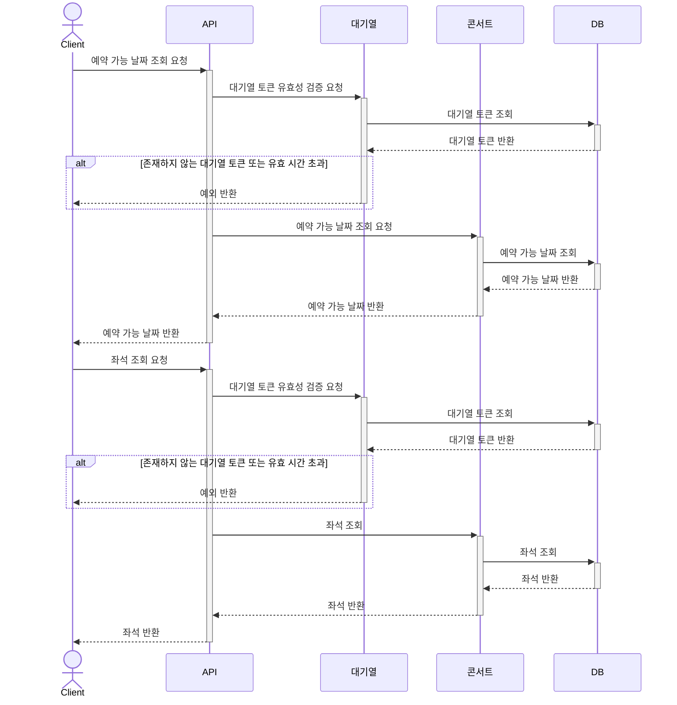
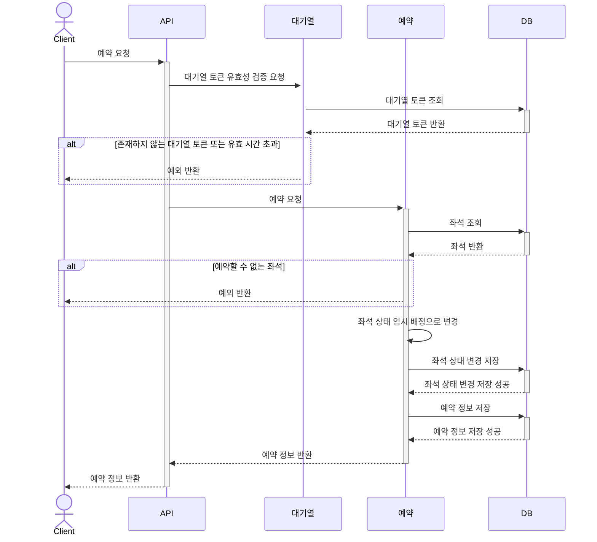
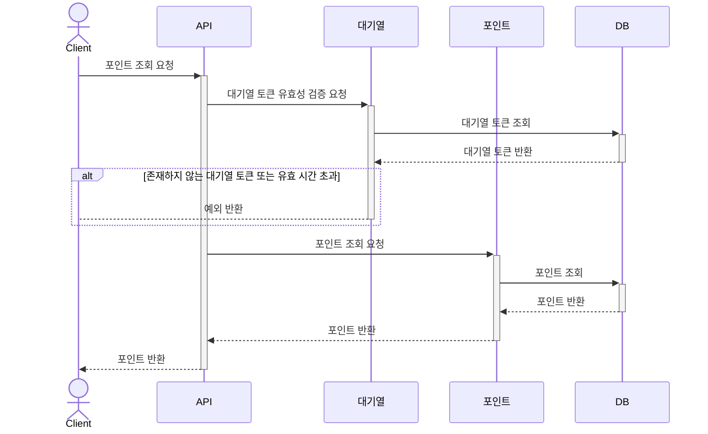
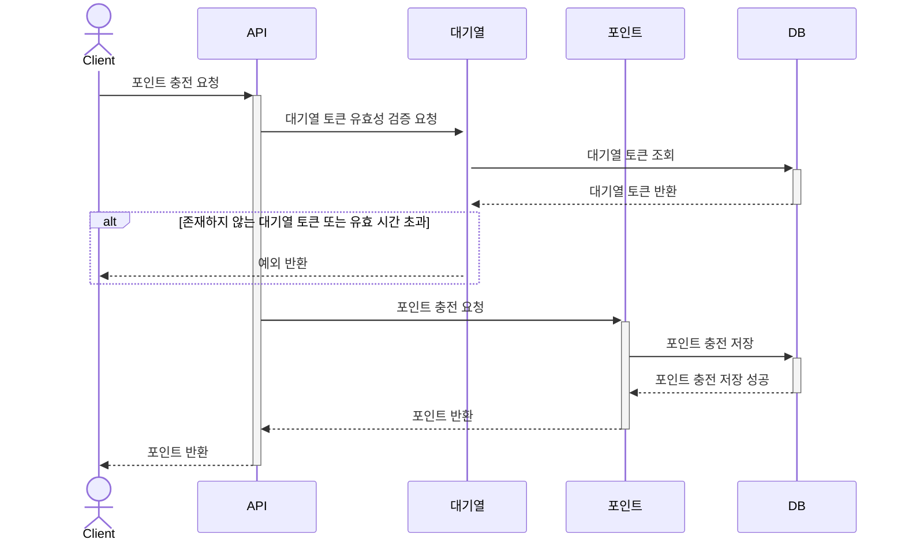
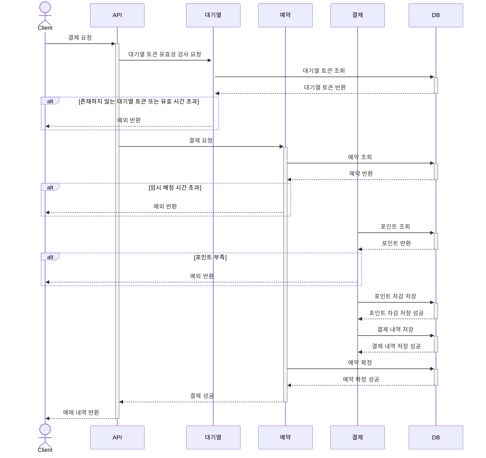

# Sequence Diagram

## 대기열 토큰 발급

```mermaid
sequenceDiagram
actor Client
participant A as API
participant B as 대기열
participant C as DB
Client->>+A: 대기열 토큰 발급 요청
A->>+B: 대기열 토큰 발급 요청
B->>B: 대기열 토큰 생성
B->>+C: 대기열 토큰 저장
C-->>-B: 대기열 토큰 저장 성공
B-->>A: 대기열 토큰 반환
A-->>-Client: 대기열 토큰 반환
```

---

## 대기열 토큰 조회

```mermaid
sequenceDiagram
actor Client
participant A as API
participant B as 대기열
participant C as DB
loop 5초마다 조회
Client->>+A: 대기열 토큰 조회 요청
A->>+B: 대기열 토큰 조회 요청
B->>+C: 대기열 토큰 조회
C-->>-B: 대기열 토큰 반환
alt 존재하지 않는 대기열 토큰 또는 유효 시간 초과
B-->>Client: 예외 반환
end
B-->>A: 대기열 토큰 반환
A-->>-Client: 대기열 토큰 반환
end
```

---

## 예매 가능 날짜 및 좌석 조회

```mermaid
sequenceDiagram
actor Client
participant A as API
participant B as 대기열
participant C as 콘서트
participant D as DB
Client->>+A: 예약 가능 날짜 조회 요청
A->>+B: 대기열 토큰 유효성 검증 요청
B->>+D: 대기열 토큰 조회
D-->>-B: 대기열 토큰 반환
alt 존재하지 않는 대기열 토큰 또는 유효 시간 초과
B-->>-Client: 예외 반환
end
A->>+C: 예약 가능 날짜 조회 요청
C->>+D: 예약 가능 날짜 조회
D-->>-C: 예약 가능 날짜 반환
C-->>-A: 예약 가능 날짜 반환
A-->>-Client: 예약 가능 날짜 반환
Client->>+A: 좌석 조회 요청
A->>+B: 대기열 토큰 유효성 검증 요청
B->>+D: 대기열 토큰 조회
D-->>-B: 대기열 토큰 반환
alt 존재하지 않는 대기열 토큰 또는 유효 시간 초과
B-->>-Client: 예외 반환
end
A->>+C: 좌석 조회
C->>+D: 좌석 조회
D-->>-C: 좌석 반환
C-->>-A: 좌석 반환
A-->>-Client: 좌석 반환
```

---

## 좌석 예약 요청

```mermaid
sequenceDiagram
actor Client
participant A as API
participant B as 대기열
participant C as 예약
participant D as DB
Client->>+A: 예약 요청
A->>+B: 대기열 토큰 유효성 검증 요청
B->>+D: 대기열 토큰 조회
D-->>-B: 대기열 토큰 반환
alt 존재하지 않는 대기열 토큰 또는 유효 시간 초과
B-->>Client: 예외 반환
end
A->>+C: 예약 요청
C->>+D: 좌석 조회
D-->>-C: 좌석 반환
alt 예약할 수 없는 좌석
C-->>Client: 예외 반환
end
C->>C: 좌석 상태 임시 배정으로 변경
C->>+D: 좌석 상태 변경 저장
D-->>-C: 좌석 상태 변경 저장 성공
C->>+D: 예약 정보 저장
D-->>-C: 예약 정보 저장 성공
C-->>-A: 예약 정보 반환
A-->>-Client: 예약 정보 반환
```

---

## 포인트 조회

```mermaid
sequenceDiagram
actor Client
participant A as API
participant B as 대기열
participant C as 포인트
participant D as DB
Client->>+A: 포인트 조회 요청
A->>+B: 대기열 토큰 유효성 검증 요청
B->>+D: 대기열 토큰 조회
D-->>-B: 대기열 토큰 반환
alt 존재하지 않는 대기열 토큰 또는 유효 시간 초과
B-->-Client: 예외 반환
end
A->>+C: 포인트 조회 요청
C->>+D: 포인트 조회
D-->>-C: 포인트 반환
C-->>-A: 포인트 반환
A-->>-Client: 포인트 반환
```

---

## 포인트 충전

```mermaid
sequenceDiagram
actor Client
participant A as API
participant B as 대기열
participant C as 포인트
participant D as DB
Client->>+A: 포인트 충전 요청
A->>+B: 대기열 토큰 유효성 검증 요청
B->>+D: 대기열 토큰 조회
D-->>-B: 대기열 토큰 반환
alt 존재하지 않는 대기열 토큰 또는 유효 시간 초과
B-->>Client: 예외 반환
end
A->>+C: 포인트 충전 요청
C->>+D: 포인트 충전 저장
D-->>-C: 포인트 충전 저장 성공
C-->>-A: 포인트 반환
A-->>-Client: 포인트 반환
```

---

## 결제

```mermaid
sequenceDiagram
actor Client
participant A as API
participant B as 대기열
participant C as 예약
participant D as 결제
participant E as DB
Client->>+A: 결제 요청
A->>+B: 대기열 토큰 유효성 검사 요청
B->>+E: 대기열 토큰 조회
E-->>-B: 대기열 토큰 반환
alt 존재하지 않는 대기열 토큰 또는 유효 시간 초과
B-->>Client: 예외 반환
end
A->>+C: 결제 요청
C->>+E: 예약 조회
E-->>-C: 예약 반환
alt 임시 배정 시간 초과
C-->>Client: 예외 반환
end
D->>+E: 포인트 조회
E-->>-D: 포인트 반환
alt 포인트 부족
D-->>Client: 예외 반환
end
D->>+E: 포인트 차감 저장
E-->>-D: 포인트 차감 저장 성공
D->>+E: 결제 내역 저장
E-->>-D: 결제 내역 저장 성공
C->>+E: 예약 확정
E-->>-C: 예약 확정 성공
C-->>-A: 결제 성공
A-->>-Client: 예매 내역 반환
```